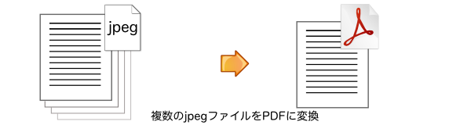

[Home](https://oasis3855.github.io/webpage/) > [Software](https://oasis3855.github.io/webpage/software/index.html) > [Software Download](https://oasis3855.github.io/webpage/software/software-download.html) > ***linux-bookscan-jpg2pdf*** (this page)

 
 

書籍を何冊も抱えて出張や旅行に行く時代は、電子書籍端末が現れて過去のものになったと思います。たとえ 見栄えのクオリティ が悪くなっても情報が取り出せればよいガイドブックやマニュアル類といった本は、電子書籍端末に全部放り込んで身軽になるという選択肢も悪くないですよ。

- [1) 書籍をスキャンする](#1-書籍をスキャンする)
  - [画面表示する電子書籍の場合](#画面表示する電子書籍の場合)
- [2)  スキャンした画像の画質調整と左右二分割](#2--スキャンした画像の画質調整と左右二分割)
- [3)  複数のjpegファイルを結合してPDFファイルに変換](#3--複数のjpegファイルを結合してpdfファイルに変換)
- [番外編) 複数のjpegファイルを結合してAmazon Kindle専用のmobiファイルに変換](#番外編-複数のjpegファイルを結合してamazon-kindle専用のmobiファイルに変換)

 
 

### このページの概要

* 裁断できない本

  他の人から借りた本や図書館の本を含め、裁断できない本を対象とします。裁断できるのであれば、連続取り込み可能なドキュメントスキャナを使って、とても簡単にPDF化出来るでしょう。

* イメージスキャナ、複合機

  書籍は、イメージスキャナや複合機で画像取り込みします。取り込んだ画像はjpegファイルに保存できているものとします。

* Linux用Perlスクリプト

  このページで紹介するソフトウエアは、Linux/BSD用です。WindowsでもActivePerlをインストールすれば、無理やり使えなくはないですが、Windows用の便利なフリーソフトウエアもあるようですので、そちらを使うことをおすすめします。

## 1) 書籍をスキャンする

  

取り込んだjpeg画像の画質調整は、この後の「スキャンした画像の画質調整と左右二分割」で行いますので、標準的な画質で取り込めば良いと思います。ファイルは 001.jpg, 002.jpg, 003.jpg ..... と連番で保存しておくと、あとの処理が楽です。

Linuxで連続スキャンする場合は [xsane](http://www.sane-project.org/) が、Windowsで連続スキャンする場合は BTScan が便利です。

### 画面表示する電子書籍の場合

画面に表示するタイプの電子カタログ・電子書籍の場合は、『[デスクトップ全画面表示した書籍を,左右キーで自動ページ送りして連続キャプチャ](capture-desktopimage/)』を使うと、jpegファイル保存を自動化できます。

## 2)  スキャンした画像の画質調整と左右二分割 

  

左右見開きページを1枚のjpg画像として取り込んだ場合は、『[jpeg画像ファイル二分割・コントラスト調整](image-divider/)』を用いて左右ニ分割して保存します。

## 3)  複数のjpegファイルを結合してPDFファイルに変換 

  

『[複数のjpegファイルを結合しpdfファイルを作成する](jpg2pdf/)』のPerlスクリプトを用います。取り込んだ画像を劣化させずにPDFファイルに結合することができます。

## 番外編) 複数のjpegファイルを結合してAmazon Kindle専用のmobiファイルに変換

Amazon Kindleでしか読まないのであれば、余白表示が最適化されるmobiファイルに変換するほうがよい。『[複数のjpegファイルを結合しKindle用mobiファイルを作成する](jpg2kindle/)』で概要説明しています。

