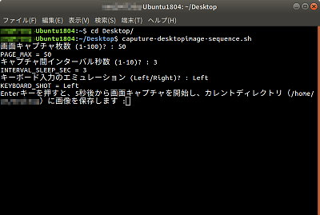

デスクトップ全画面表示した書籍を  左右キーで自動ページ送りして連続キャプチャ Desktop image sequence capture with auto key push (Linux shell script) 

---

- [機能の概要](#機能の概要)
- [利用方法](#利用方法)
- [実画面の解像度以上でキャプチャしたい場合](#実画面の解像度以上でキャプチャしたい場合)
- [バージョン履歴](#バージョン履歴)
- [ライセンス](#ライセンス)

###  機能の概要
Linuxデスクトップに全画面表示し、キーボードの左右矢印キーでページ送りするタイプの書籍やカタログなどの画像を連続キャプチャし、jpeg画像に保存する自動化スクリプトです。 

### 利用方法

1. 電子カタログ・電子書籍のページを開き、全画面表示する

2. ターミナル画面を開き、画像を保存したいディレクトリをカレントディレクトリしたのち、このスクリプトを起動

3. スクリプト実行の条件を設定
    1. キャプチャ枚数を設定
    2. インターバル秒数を設定
    3. キーボード押し下げエミュレーションの設定

        

4. 電子カタログ・電子書籍のページを最前面に 
   Alt-Tabキーなどで最前面に設定します

5. キャプチャ開始（カレントディレクトリに連番ファイル名のjpg画像が保存される）

### 実画面の解像度以上でキャプチャしたい場合 

解像度1920x1080のモニタで表示している場合、次のコマンドでLinuxの画面解像度を一時的に引き上げられる。（モニタ名称をHDMIとしているが、これは xrandr を引数なしで実行すれば調べられる）

    xrandr --output HDMI --panning 3840x2860

処理が完了した後は、階層度をもとに戻しておく

    xrandr --output HDMI --panning 0x0

### バージョン履歴
- Version 1.0 (2019/Oct/13)

### ライセンス

このスクリプトは [GNU General Public License v3ライセンスで公開する](https://gpl.mhatta.org/gpl.ja.html) フリーソフトウエア
