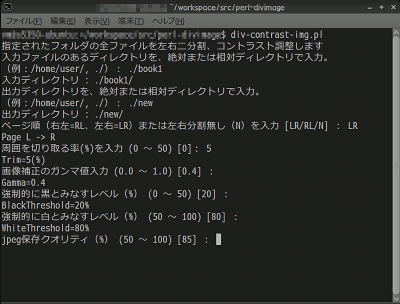

## jpeg画像ファイル二分割・コントラスト調整 for 書籍スキャン Split and Contrast Adjust for jpeg Image , Linux/Windows Perl Script<!-- omit in toc -->

---
[Home](https://oasis3855.github.io/webpage/) > [Software](https://oasis3855.github.io/webpage/software/index.html) > [Software Download](https://oasis3855.github.io/webpage/software/software-download.html) > [linux-bookscan-jpg2pdf](../README.md) > ***image-divider*** (this page)

 
 

Last Updated : Oct. 2019

- [ソフトウエアのダウンロード](#ソフトウエアのダウンロード)
- [機能の概要](#機能の概要)
  - [このソフトウエアの特徴](#このソフトウエアの特徴)
  - [類似ソフトウエアの紹介](#類似ソフトウエアの紹介)
- [動作環境](#動作環境)
- [インストール、実行方法](#インストール実行方法)
  - [OSによる文字コード扱い差異の切り替え](#osによる文字コード扱い差異の切り替え)
- [バージョン履歴](#バージョン履歴)
- [ライセンス](#ライセンス)

 
 

## ソフトウエアのダウンロード

-    [このGitHubリポジトリを参照する](../image-divider/) 

-    [Google Codeを参照する](https://code.google.com/archive/p/image-divider-perl/downloads) ※閉鎖 

##  機能の概要
jpegファイルを左右二分割・ガンマ調整・強制白レベル/黒レベル調整して、連番をつけて新規画像保存するコマンドライン ツールです。主に、書籍を見開きでスキャンした画像を、左右分割して保存する目的で利用するスクリプトです。

### このソフトウエアの特徴
- 画像を左右二分割します。分割部分のオーバーラップ率も指定可能
- 二分割せずに、色調調整だけを行うことも可能
- ガンマ調整、強制白レベル、強制黒レベルが指定可能
- 周囲余白の切り抜き（画面サイズに対する％指定）または、左右の切り抜き（px指定）が可能
- 結果をjpegファイルに保存（圧縮率指定可能） 

### 類似ソフトウエアの紹介
このページで配布するスクリプトより処理時間ははるかに長くかかりますが、[Scan Tailor](https://scantailor.org/)はページの傾き補正・余白の除去・色調補正を自動で行なってくれます。

## 動作環境
Perl (Linux/BSD) または Active Perl (Windows) 

## インストール、実行方法
任意のディレクトリにこのスクリプトを置くことが出来ます。特段のインストール作業は不要で、利用時にスクリプトを実行して下さい

    perl image-divider.pl

### OSによる文字コード扱い差異の切り替え
配布時のファイルはLinux用として設定されているため、Windowsで利用する場合はスクリプトの該当部分を次のように変更

    my $flag_os = 'windows';  # linux/windows
    my $flag_charcode = 'shiftjis';     # utf8/shiftjis

## バージョン履歴
- Version 0.1 (2010/12/06)

  当初バージョン 

- Version 0.2 (2012/01/10)

  Windows (shiftjis)対応 
  画像左右分割時、ページ左右中央のオーバーラップ処理対応 
  プログラム名称を div-contrast-img.pl から image-divider.pl に変更 

- Version 0.3 (2012/03/08)

  ディレクトリ名、ファイル名にスペースが入る場合に対応 
  入出力が同一ディレクトリの場合の判定強化 

- Version 0.3.1 (2012/03/09)

  Windowsでの日本語ファイル名対応 

- Version 0.4 (2015/03/20)

- Version 0.5 (2019/10/13)

  左右Crop(px単位)機能追加 
  周囲Crop(%単位)機能のバグ修正 

## ライセンス
このスクリプトは [GNU General Public License v3ライセンスで公開する](https://gpl.mhatta.org/gpl.ja.html) フリーソフトウエア

