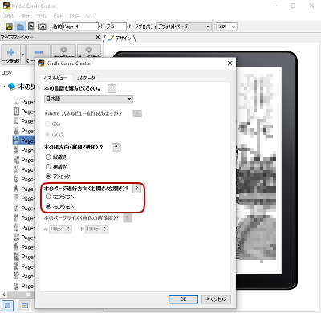
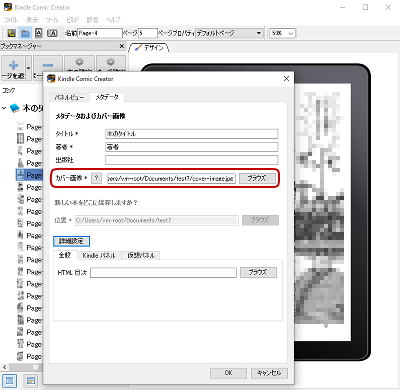
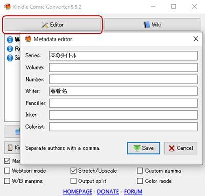
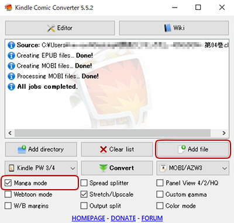
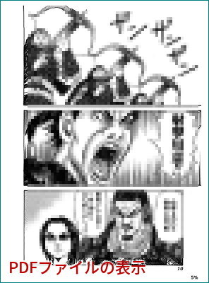
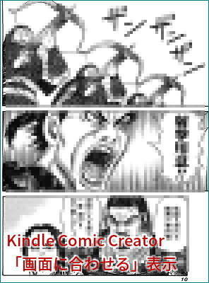
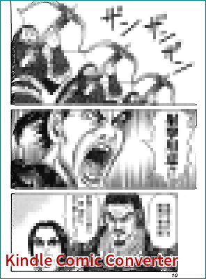

## 複数のjpegファイルを結合しKindle用mobiファイルを作成する for 書籍スキャン Make Amazon Kindle mobi file from multiple jpeg

このページは拙作ソフトウエアの配布ではなく、Amazon公式ソフトウエアや第三者の作成したソフトウエアの利用法、変換結果を考察するページです。

### 概要
Amazon Kindleで自炊した電子書籍を読む場合、PDFではシステム制限で余白が表示されてしまい結果としてページが小さく縮小表示されてしまう。

Amazon Kindle専用のファイル（mobiファイル）を作成すれば、画面いっぱいにページ表示が可能だ。 

### jpegをmobiに変換するソフトウエアと使い方
#### Kindle Comic Creator (Amazon純正ソフト) 
Amazonの電子出版技術サイト『[Kindle Comic Creator](https://www.amazon.co.jp/gp/feature.html?ie=UTF8&docId=3077699036)』からWindows版（Windows XP以降）とMac版がダウンロード可能。

インストール時に『Kindle Previewer』を同時にインストールするか表示されるが、mobiファイルの作成だけならKindle Previewerは不要。

Kindle Comic Creatorを起動する前に、スキャンデータ（jpegファイル）がzip圧縮されている場合は解凍して任意のディレクトリ内に格納しておく。

Kindle Comic Creatorを起動し、画面中央の「新しい本を作成」ボタンを押してmobiファイルの属性設定を行う。 

   
  「新しい本を作成」のパネルビュー

ここでは、本のページ送り方向を原本の向きに合わせて設定する。通常の漫画本や週刊誌・経済雑誌の場合は「右から左へ」、英文書籍や科学技術書籍は「左から右へ」が一般的な設定となる。 

   
  「新しい本を作成」のメタデータ

本の「タイトル」と「著者」の値は必須。また、カバー画像（1ページ目のjpegファイル）の設定も必須。

属性設定（パネルビューとメタデータ）が終わると、画像ファイルの選択画面となる。さきほど、1ページ目のjpegファイルはカバー画像として取り込み済みのため、ここでは**2ページ以降**のファイルを選択する。

ファイルの選択が終われば、画面のプレビューが表示される。Kindle Comic Creatorのメニューより「ビルド」を実行すると、mobiファイルが指定したディレクトリ内に作成される。 

####  Kindle Comic Converter（フリーソフト） と Kindlegen (Amazon純正ソフト) 

[Kindle Comic Converter](https://kcc.iosphe.re/)より『Kindle Comic Converter』（Windows x86-64版と、Mac版）のインストーラを、[KindleGen](https://www.amazon.com/gp/feature.html?ie=UTF8&docId=1000765211)より『Amazon KindleGen コマンドツール』をそれぞれダウンロードする。

Kindle Comic Converterをインストールした後、インストールディレクトリにKindleGen.exeファイルをコピーする。

あらかじめ書籍のスキャン画像はzipファイル圧縮し、拡張子を.cbz に書き換えておく。

Kindle Comic Converterを起動し、Editorボタンを押して電子書籍のcbzファイルを選択すると、メタデータ設定画面が表示される。 

   
  Kindle Comic Converterのメタデータ設定画面

ファイル名が自動的にSeries欄に入力されているが、必要であれば、それぞれの欄を任意の文字列に書き換えることも出来る。

Saveボタンを押すと**設定ファイルがcbzファイルに書き込まれる**ので、オリジナルのcbzファイルを汚したくない場合は作業用にcbzファイルをコピーして使うと良い。

変換設定画面が表示されるので、「Add File」ボタンを押して変換対象のcbzファイルを読み込む。 

 
Kindle Comic Converterの変換設定画面

ページ送り方向が「右から左」であれば「Manga mode」をチェックする。

Strech/Upscaleのチェックをグレー状態（半チェック）にすると、すべてのファイルをアスペクト比を無視して画面いっぱいに引き伸ばして処理される。通常チェック状態（デフォルト値）では、アスペクト比が守られて引き伸ばされる。

「Convert」ボタンを押すと、mobiファイルが作成される。 

### ファイルの圧縮率 

元データとなるjpegファイルを高圧縮にすれば、PDFファイルのサイズは小さく出来る。

しかし、mobiファイルの作成はターゲットデバイスの解像度設定を変更する以外、圧縮率を設定できない。 また、変換中に自動的に画像が再圧縮されるため、元データのjpegサイズはほぼ反映されないと考えて良いと思う。 

###  画面表示の比較

#### PDFの場合

  

PDF表示の場合は、画面の周囲に無駄な余白が表示される 

#### mobiの場合

   
  Kindle Comic Creator (Amazon純正ソフト) で作成したmobiファイルの表示

   
  Kindle Comic Converterで作成したmobiファイルの表示

mobi表示のデフォルトは、アスペクト比を保って画面いっぱいに引き伸ばされる。

アスペクト比を無視して画面いっぱいに引き伸ばした表示は、Amazon純正の『Kindle Comic Creator』を用いて変換したmobiファイルの場合は、Kindleのページ表示設定メニューで読書中に切替可能。フリーソフトの『Kindle Comic Converter』を用いて変換したmobiファイルの場合は、変換時の設定（Strech/Upscaleのチェック）から切り替えることは出来ない。

