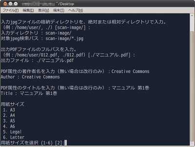

複数のjpegファイルを結合しpdfファイルを作成する for 書籍スキャン 
Make pdf from multiple jpeg files , Linux/Windows Perl script

---
[Home](https://oasis3855.github.io/webpage/) > [Software](https://oasis3855.github.io/webpage/software/index.html) > [Software Download](https://oasis3855.github.io/webpage/software/software-download.html) > ***jpg2pdf*** (this page)

 
 

- [機能の概要](#機能の概要)
  - [類似ソフトウエアの紹介](#類似ソフトウエアの紹介)
  - [制限](#制限)
- [インストール、実行方法](#インストール実行方法)
  - [OSによる文字コード扱い差異の切り替え](#osによる文字コード扱い差異の切り替え)
- [バージョン履歴](#バージョン履歴)
- [ライセンス](#ライセンス)

 
 

###  機能の概要
指定されたフォルダに格納されているjpegファイル（検索条件 *.jpg）をファイル名順に並べ替え、1つのpdfファイルに変換保存するコマンドライン ツールです。

#### 類似ソフトウエアの紹介
[pdftkコマンド](https://www.pdflabs.com/tools/pdftk-the-pdf-toolkit/)や[ImageMagickのconvertコマンド](http://www.imagemagick.org/script/convert.php)と同様の処理を行うソフトウエアですが、より高速に処理を行うことができます。

####このソフトウエアの特徴

- convertコマンドに比べて高速変換
- プロパティ（著作者名、タイトル）を同時入力可能
- 文書解像度（印刷用紙大きさ）を指定可能

#### 制限

- プログレッシブjpegは結合不可
- 高圧縮率で保存されたjpegは結合不可

 動作環境

Perl (Linux/BSD) または Active Perl (Windows)

### インストール、実行方法
任意のディレクトリにこのスクリプトを置くことが出来ます。特段のインストール作業は不要で、利用時にスクリプトを実行して下さい

    perl jpg2pdf.pl

#### OSによる文字コード扱い差異の切り替え
配布時のファイルはLinux用として設定されているため、Windowsで利用する場合はスクリプトの該当部分を次のように変更

    my $flag_os = 'windows';  # linux/windows
    my $flag_charcode = 'shiftjis';     # utf8/shiftjis

### バージョン履歴
- Version 0.1 (2011/01/18)

- Version 0.2 (2012/03/10)

  空白文字を含むファイル名への対応 

- Version 0.3 (2019/10/13)

  PDFバージョン（1.0〜1.3）の指定可能 

### ライセンス
このスクリプトは [GNU General Public License v3ライセンスで公開する](https://gpl.mhatta.org/gpl.ja.html) フリーソフトウエア

